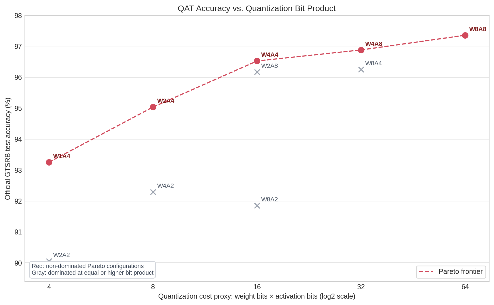

# Quantized Traffic Sign Recognition on PYNQ-Z2

This project trains a small CNN for GTSRB traffic sign recognition, quantizes it
with Brevitas, and deploys it with FINN on a PYNQ-Z2 board.

## Current features

- 43-class GTSRB classification
- 48 x 48 RGB input
- Sequence-aware train and validation split
- Data augmentation for scale, blur, color, rotation, and translation
- Class weights and targeted oversampling
- TensorBoard logging
- Accuracy and macro F1 checkpoints
- Separate checkpoint test script
- QAT experiments from W8A8 to binary-weight W1A4
- QONNX preprocessing export for NHWC UINT8 input
- FINN W4A4 bitstream build and PYNQ-Z2 smoke test

## QAT trade-off

The chart uses the weight-bit × activation-bit product as a simple quantization
cost proxy. Red points are non-dominated accuracy-cost configurations on the
official GTSRB test split.



Current Pareto configurations: `W1A4`, `W2A4`, `W4A4`, `W4A8`, and `W8A8`.
The W1A4 experiment uses binary per-tensor weights; W2/W4/W8 use per-channel
weight scaling.

## Project structure

```text
.
|-- README.md
|-- docs/
|   `-- learning-notes.md
`-- src/
    |-- gtsrb_utils.py   # Data split, transforms, loaders, and class weights
    |-- tiny_vgg.py      # Lightning model
    |-- quant_vgg.py     # Brevitas QAT model, including binary quantization
    |-- run_experiment.py # QAT/PTQ experiment, test, and QONNX export
    |-- preprocessor.py  # Export NHWC UINT8 preprocessing to QONNX
    |-- train.py         # Training and checkpoint creation
    `-- test.py          # Test one saved checkpoint without training
```

Data, checkpoints, TensorBoard logs, and FPGA build files are not committed.

## Setup

Install the required Python packages in a virtual environment:

```bash
pip install torch torchvision lightning torchmetrics tensorboard numpy
```

## Training

Run from the repository root:

```bash
python src/train.py
```

The dataset is downloaded into `data/`. TensorBoard logs are written to `logs/`
and model checkpoints are written to `checkpoints/`.

Open TensorBoard with:

```bash
tensorboard --logdir logs
```

## Testing

Set `checkpoint_path` in `src/test.py`, then run:

```bash
python src/test.py
```

The test script loads the selected checkpoint and does not run training.

## FPGA status

The W4A4 QAT classifier has completed QONNX export, FINN compilation, Vivado
synthesis, and a PYNQ-Z2 smoke test. The next deployment candidates are W2A4
and W1A4. FPGA build artifacts, models, datasets, and local experiment outputs
are intentionally not committed.

## Status

The floating-point, QAT, and first FPGA deployment stages are complete.
